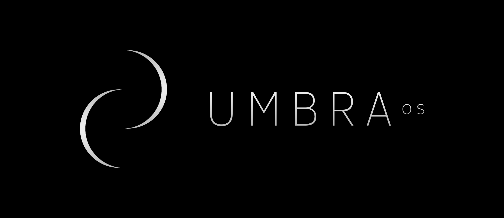
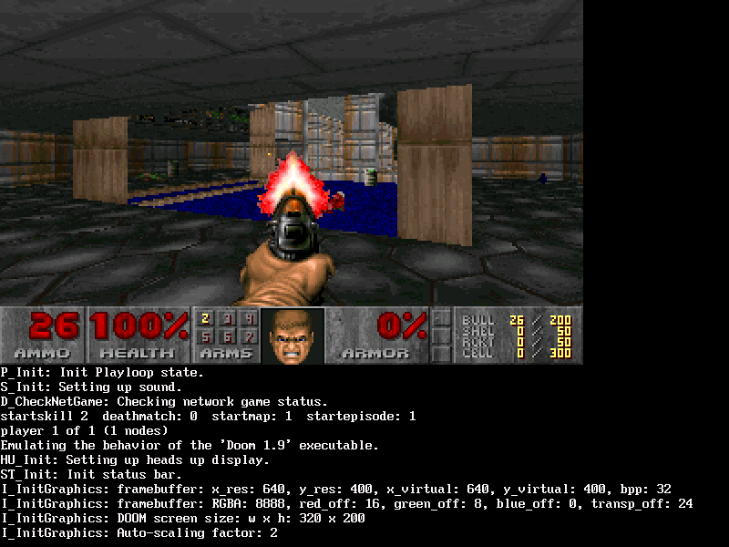
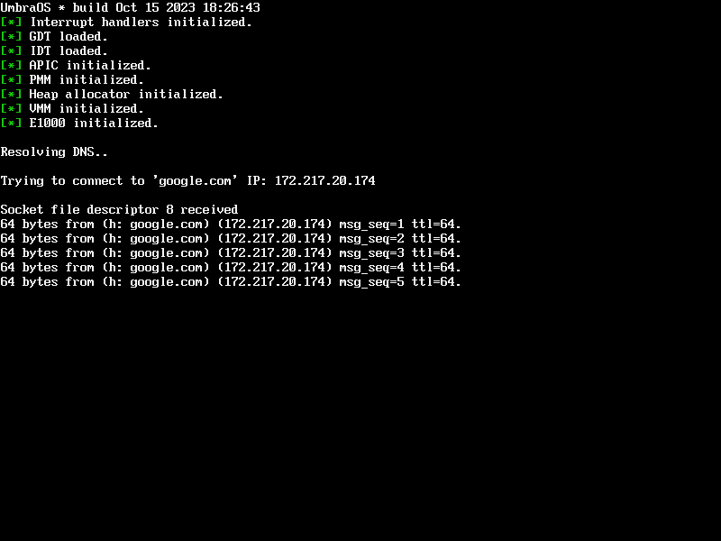

# Umbra OS
A 64-bit hobby operating system written from scratch.

Features:
- [x] PMM, VMM, Heap allocator
- [x] Timer
- [x] PS/2 keyboard
- [x] VFS
- [x] Scheduler
- [ ] SMP
- [x] User space
- [x] Can run ELFs
- [x] Can run DOOM
- [x] Networking
    - [ ] TCP
    - [x] UDP
    - [x] ICMP
- [x] Has a lot of memory leaks and inconsistent coding style

# Screenshots

